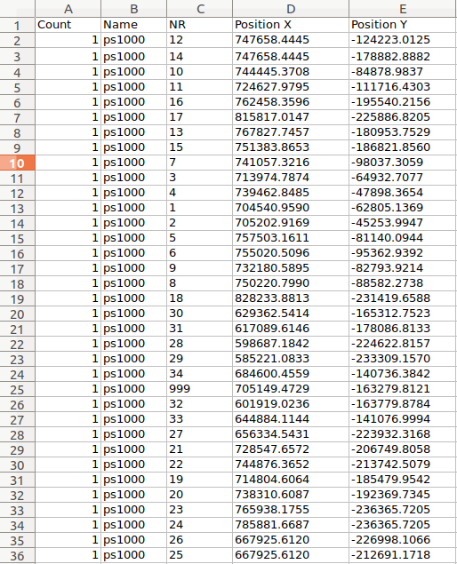
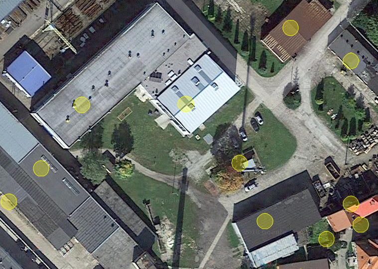

# CoordinatesCalculator
My friend asked me to write a simple script for his work to automate part of his job.
The task was to calculate geographic coordinates of points from excel file generated with AutoCad.



Point with index (NR) 999 is the point where geographic coordinates are given.
We can compute the distance between that point and others. Then using the fact that:

>...one degree at the equator represents 111,319.9 meters. As one moves away from the equator towards a pole, however, one degree of longitude is multiplied by the cosine of the latitude, decreasing the distance, approaching zero at the pole. [Wikipedia](https://en.wikipedia.org/wiki/Decimal_degrees)

compute cooridnates of other points.

Result is saved to an excel file.
In addition to check wheter everything looks fine script generates html file with points scattered on google maps.



## Instalation
Packages required to run script are listed in [requirements.txt.](requirements.txt). To run the script use:

```python main.py``` 